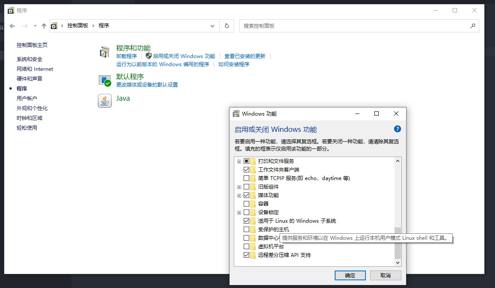
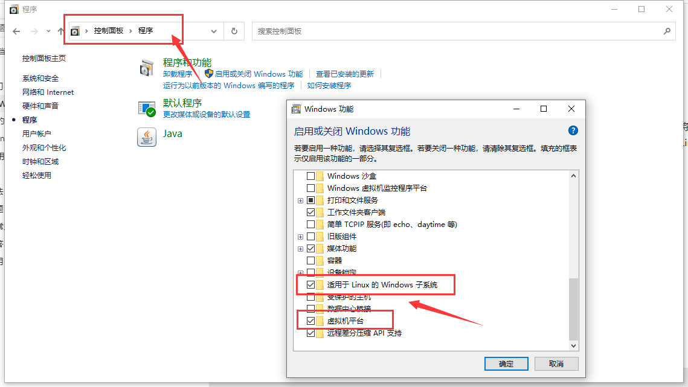
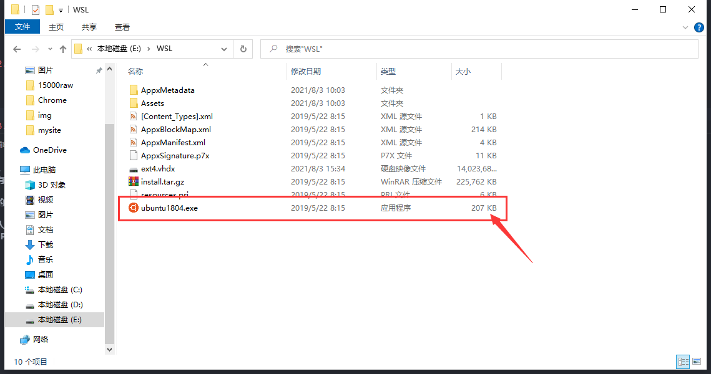
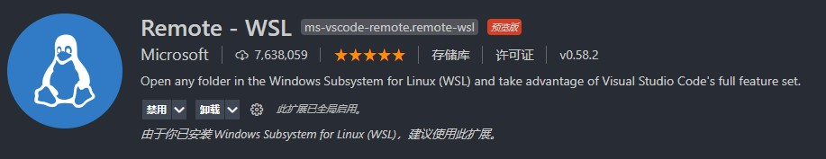

# WSL2-config
- [安装WSL2](https://docs.microsoft.com/zh-cn/windows/wsl/install-win10#step-4---download-the-linux-kernel-update-package)
- [自定义WSL安装位置](https://zhuanlan.zhihu.com/p/263089007)
## 指定位置安装Ubuntu(18.04) + Ananconda + VSCode
1. 启用WSL和虚拟机功能
  <!--  -->
  <div align="center">
      
  </div>
  或

   ```bash
   dism.exe /online /enable-feature /featurename:Microsoft-Windows-Subsystem-Linux /all /norestart`
   dism.exe /online /enable-feature /featurename:VirtualMachinePlatform /all /norestart
   ```

2. 指定位置安装
  - [手动下载安装包](https://docs.microsoft.com/zh-cn/windows/wsl/install-manual)
  - 将后缀名`.appx`修改为`.zip`
  - 解压到指定位置
  - 双击`.exe`文件安装
  <div align="center">
      
  </div>  
3. WSL2启动时提示参考的对象类型不支持尝试的操作（若有）
   [解决方案](https://xinzsh.com/notes/WSL2-issues.html)
4. 换源（若需要）
   ```bash
   sudo cp /etc/apt/sources.list /etc/apt/sources.list.bak
   sudo vim /etc/apt/sources.list
   ```
   - 注释掉`sources.list`中的默认源
   - 添加[清华源](https://mirror.tuna.tsinghua.edu.cn/help/ubuntu/)
5. 打开VSCode, 安装Remote-WSL插件
  <div align="center">
      
  </div> 
6. 打开Ubuntu系统终端，输入`code .`，安装VSCode Server，安装完成后会在本地Windows系统自动打开VSCode，这时已经实现了Windows与Ubuntu子系统的连接和同步
   - 若想在子系统中查看windows下的资源，windows资源都挂载在 `/mnt`路径下
  <div align="center">
      
  </div> 
7. 子系统安装Anaconda
   - Windows系统中下载[anaconda](https://www.anaconda.com/products/individual) Linux版本
   `cd /mnt/your/path/`
   `bash Anaconda3-xxxx.xx-Linux-x86_64.sh`
   - 在安装过程中，记住安装路径，后续将这个路径加入环境变量，其余一路yes就可
   - 添加环境变量, `sudo vim /etc/profile`
   - 添加 `export PATH=/home/rvlis/anaconda3/bin:$PATH`, 其中路径替换为自己的安装路径
   - 重新加载环境变量 `source /etc/profile`
   - [Linux环境变量配置详解](https://segmentfault.com/a/1190000038313883)
## Keep going! 🐱‍🏍