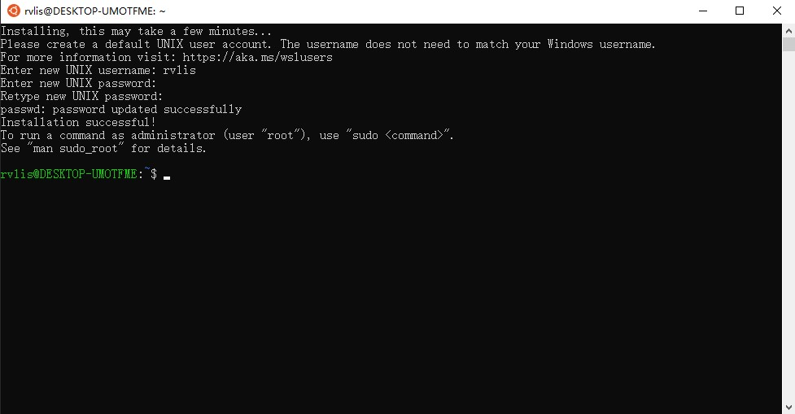

# WSL-config

## Ubuntu(18.04) + Ananconda + VSCode
1. 控制面板-程序-启用或关闭Windows功能-开启适用于Linux的Windows子系统
  
2. win10 Microsoft Store-下载Ubuntu 18.04发行版
  
3. 安装-输入用户名（小写）和密码（输入时不可见）
  
4. 换源（如果需要）
   - `sudo cp /etc/apt/sources.list /etc/apt/sources.list.bak`
   - `sudo vim /etc/apt/sources.list`
   - 添加[清华源](https://mirror.tuna.tsinghua.edu.cn/help/ubuntu/)
5. 打开VSCode, 安装Remote-WSL插件
   
6. 打开Ubuntu子系统，输入`code .`，安装VSCode Server，安装完成后会在本地Windows系统自动打开VSCode，这时已经实现了Windows与Ubuntu子系统的连接和同步
   - 若想在子系统中查看windows下的资源，windows资源都挂载在 `/mnt`路径下
   
7. 子系统安装Anaconda
   - Windows系统中下载[anaconda](https://www.anaconda.com/products/individual) Linux版本
    
   - `cd /mnt/your/path/`
   - `bash Anaconda3-xxxx.xx-Linux-x86_64.sh`
   - 在安装过程中，记住安装路径，后续将这个路径加入环境变量，其余一路yes就可
   
   - 添加环境变量, `sudo vim /etc/profile`
   - 添加 `export PATH=/home/rvlis/anaconda3/bin:$PATH`, 其中路径替换为自己的安装路径
   - 重新加载环境变量 `source /etc/profile`
   - 检查是否配置成功
   